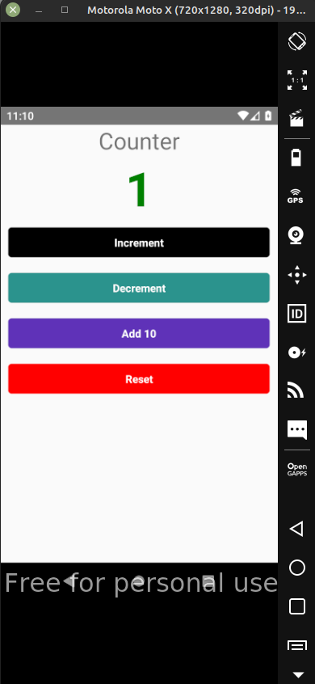

# Redux Tutorial

Exemplo de uso do redux no react native em uma simples aplicação de contagem, do canal no youtube BetoMoedano - Tutorial React Native Redux con Typescript | Redux para principiantes.

#### tecnologias usadas:

- typescript
- react-redux
- @reduxjs/toolkit

---

## Screenshot

---
